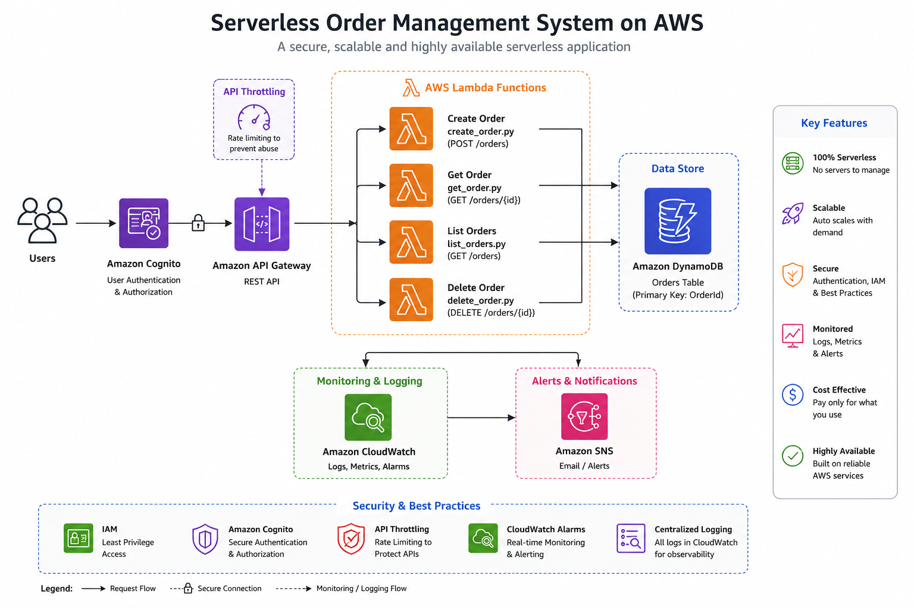

# Serverless Order Management System on AWS

A production-style serverless backend built using **Amazon API Gateway, AWS Lambda, Amazon DynamoDB, Amazon Cognito, IAM, CloudWatch, SNS, and API throttling**.

This project was built to understand how modern cloud-native backend systems are designed without managing servers. It supports creating, reading, listing, and deleting customer orders through API endpoints, while also adding authentication, monitoring, alerting, least-privilege IAM, and request throttling.

---

## Architecture Diagram



---

## Project Overview

The goal of this project was to build a secure and scalable serverless order management API on AWS.

Instead of running backend code on EC2 servers, the application uses AWS Lambda functions that run only when an API request is made. API Gateway acts as the public entry point, DynamoDB stores order data, Cognito handles user authentication, and CloudWatch/SNS provide monitoring and alerts.

The project started as a simple API, then evolved into a more production-aware design by adding:

* CRUD API functionality
* Cognito authentication
* Least-privilege IAM permissions
* CloudWatch logging
* CloudWatch alarm
* SNS email alerting
* API throttling

---

## Business Use Case

This project simulates a simple order management backend.

A user or frontend application should be able to:

* Create an order
* View all orders
* View a specific order by ID
* Delete an order
* Protect sensitive API actions using authentication
* Monitor backend failures
* Prevent unrestricted API traffic

This type of architecture can be used for small e-commerce systems, internal tools, mobile app backends, and event-driven serverless applications.

---

## AWS Services Used

| AWS Service            | Purpose                                          |
| ---------------------- | ------------------------------------------------ |
| API Gateway            | Public HTTPS API entry point                     |
| AWS Lambda             | Backend business logic                           |
| DynamoDB               | NoSQL database for storing orders                |
| Cognito                | User authentication and JWT-based API protection |
| IAM                    | Secure access control using least privilege      |
| CloudWatch Logs        | Lambda execution logs and debugging              |
| CloudWatch Alarm       | Error monitoring for Lambda                      |
| SNS                    | Email alerting when alarms trigger               |
| API Gateway Throttling | Protects API from excessive traffic              |

---

## Final Architecture Flow

### Create Order Flow

```text
Client / Postman
    ↓
API Gateway - POST /orders
    ↓
Cognito Authorizer
    ↓
CreateOrderFunction Lambda
    ↓
DynamoDB orders table
    ↓
Response with generated OrderId
```

### Get Order Flow

```text
Client / Postman
    ↓
API Gateway - GET /orders/{id}
    ↓
GetOrderFunction Lambda
    ↓
DynamoDB GetItem
    ↓
Returns matching order
```

### List Orders Flow

```text
Client / Postman
    ↓
API Gateway - GET /orders
    ↓
ListOrdersFunction Lambda
    ↓
DynamoDB Scan
    ↓
Returns all orders
```

### Delete Order Flow

```text
Client / Postman
    ↓
API Gateway - DELETE /orders/{id}
    ↓
DeleteOrderFunction Lambda
    ↓
DynamoDB DeleteItem
    ↓
Returns deletion confirmation
```

---

## API Endpoints

| Method | Endpoint       | Description             |
| ------ | -------------- | ----------------------- |
| POST   | `/orders`      | Create a new order      |
| GET    | `/orders`      | List all orders         |
| GET    | `/orders/{id}` | Get a specific order    |
| DELETE | `/orders/{id}` | Delete a specific order |

---

## Example Request: Create Order

```http
POST /orders
```

```json
{
  "customerName": "Kamlesh",
  "product": "MacBook Pro",
  "quantity": 1
}
```

Example response:

```json
{
  "message": "Order Created",
  "OrderId": "d44b8b7e-0381-4c11-8100-8fce98df75ff",
  "order": {
    "OrderId": "d44b8b7e-0381-4c11-8100-8fce98df75ff",
    "customerName": "Kamlesh",
    "product": "MacBook Pro",
    "quantity": 1
  }
}
```

---

## DynamoDB Table Design

Table name:

```text
orders
```

Primary key:

```text
OrderId
```

Example item:

```json
{
  "OrderId": "d44b8b7e-0381-4c11-8100-8fce98df75ff",
  "customerName": "Kamlesh",
  "product": "MacBook Pro",
  "quantity": 1
}
```

I used `OrderId` as the partition key because every order needs a unique identifier. This allows DynamoDB to retrieve a specific order quickly using `GetItem`.

---

## Lambda Functions

This project uses separate Lambda functions for each responsibility.

| Lambda Function     | Responsibility                        |
| ------------------- | ------------------------------------- |
| CreateOrderFunction | Validates input and stores new orders |
| GetOrderFunction    | Retrieves one order by OrderId        |
| ListOrdersFunction  | Lists all orders from DynamoDB        |
| DeleteOrderFunction | Deletes an order by OrderId           |

I used separate Lambda functions instead of one large function because it makes the system easier to understand, debug, secure, and maintain.

---

## Security Features

### Cognito Authentication

Amazon Cognito was used to create a user pool and protect the `POST /orders` route.

Without a valid token, the API returns:

```json
{
  "message": "Unauthorized"
}
```

This proves that anonymous users cannot access protected API routes.

---

### Least-Privilege IAM

Initially, the Lambda execution role used `AmazonDynamoDBFullAccess` while building and testing. After the APIs were working, I replaced it with a custom IAM policy that only allows the required actions on the `orders` table.

Allowed DynamoDB actions:

```text
dynamodb:PutItem
dynamodb:GetItem
dynamodb:DeleteItem
dynamodb:Scan
```

This follows the principle of least privilege.

---

### API Throttling

API Gateway throttling was configured to reduce the risk of abuse or accidental traffic spikes.

Settings used:

```text
Burst limit: 50
Rate limit: 100
```

This helps protect the API from excessive requests.

---

## Monitoring and Alerting

CloudWatch Logs were used to inspect Lambda execution and debug issues during development.

A CloudWatch alarm was created for the `CreateOrderFunction` error metric.

Alarm name:

```text
CreateOrderFunction-Errors-Alarm
```

An SNS topic was also configured to send an email notification if the alarm is triggered.

Monitoring flow:

```text
Lambda error
    ↓
CloudWatch metric
    ↓
CloudWatch alarm
    ↓
SNS topic
    ↓
Email notification
```

---

## Error Handling

The Create Order API validates required fields before storing data.

Required fields:

```text
customerName
product
quantity
```

If a user sends incomplete data:

```json
{
  "customerName": "Kamlesh"
}
```

The API returns:

```json
{
  "message": "Missing required fields",
  "missingFields": ["product", "quantity"],
  "requiredFields": ["customerName", "product", "quantity"]
}
```

This makes the API more user-friendly and easier to debug.

---

## Challenges Faced and Fixed

### 1. DynamoDB table name mismatch

The Lambda code originally referenced:

```text
Orders
```

but the actual table name was:

```text
orders
```

DynamoDB table names are case-sensitive, so this caused a `ResourceNotFoundException`.

### 2. Primary key mismatch

The table partition key was:

```text
OrderId
```

but the code initially used:

```text
orderId
```

DynamoDB key names are also case-sensitive.

### 3. Decimal serialization issue

DynamoDB returns numbers as `Decimal` objects in Python. This caused:

```text
Object of type Decimal is not JSON serializable
```

I fixed this by adding a custom serializer to convert `Decimal` values before returning JSON responses.

### 4. Cognito unauthorized response

After attaching Cognito authentication, unauthenticated POST requests returned:

```json
{
  "message": "Unauthorized"
}
```

This confirmed that the API route was successfully protected.

---

## Screenshots

Screenshots are stored in the `screenshots/` folder.

Recommended screenshots included:

```text
screenshots/api-gateway-routes.png
screenshots/lambda-functions.png
screenshots/dynamodb-table.png
screenshots/cognito-auth.png
screenshots/iam-least-privilege.png
screenshots/cloudwatch-alarm.png
screenshots/api-throttling.png
screenshots/postman-testing.png
```

---

## Repository Structure

```text
serverless-order-management-system/
│
├── README.md
├── architecture-diagram.png
│
├── lambda-functions/
│   ├── create_order.py
│   ├── get_order.py
│   ├── list_orders.py
│   └── delete_order.py
│
├── screenshots/
│   ├── api-gateway-routes.png
│   ├── lambda-functions.png
│   ├── dynamodb-table.png
│   ├── cognito-auth.png
│   ├── iam-least-privilege.png
│   ├── cloudwatch-alarm.png
│   ├── api-throttling.png
│   └── postman-testing.png
│
└── docs/
    └── blog-draft.md
```

---

## What I Learned

This project helped me understand how different AWS services work together to build a real backend system.

The most important lessons were:

* How API Gateway routes HTTP requests to Lambda
* How Lambda receives API Gateway events
* How to parse request bodies and path parameters
* How to store and retrieve data from DynamoDB
* Why DynamoDB key names and table names are case-sensitive
* How Cognito protects API routes using authentication
* Why least-privilege IAM is important
* How CloudWatch and SNS support monitoring and alerting
* Why production systems need validation, logging, throttling, and security controls

---

## Future Improvements

If I continue improving this project, I would add:

* Full JWT token testing through Postman
* AWS WAF for additional web protection
* Infrastructure as Code using Terraform
* CI/CD pipeline using GitHub Actions
* Custom domain for API Gateway
* Unit tests for Lambda functions
* Separate dev and prod environments
* More detailed CloudWatch dashboards

---

## Project Status

The AWS resources were deleted after successful testing and screenshot collection to avoid unnecessary charges. The repository contains the implementation code, architecture diagram, screenshots, and documentation of the completed build.

---

## Author

**Kamlesh Dubale**
Cloud & DevOps Engineer
Portfolio: `kamleshcloud.com`
